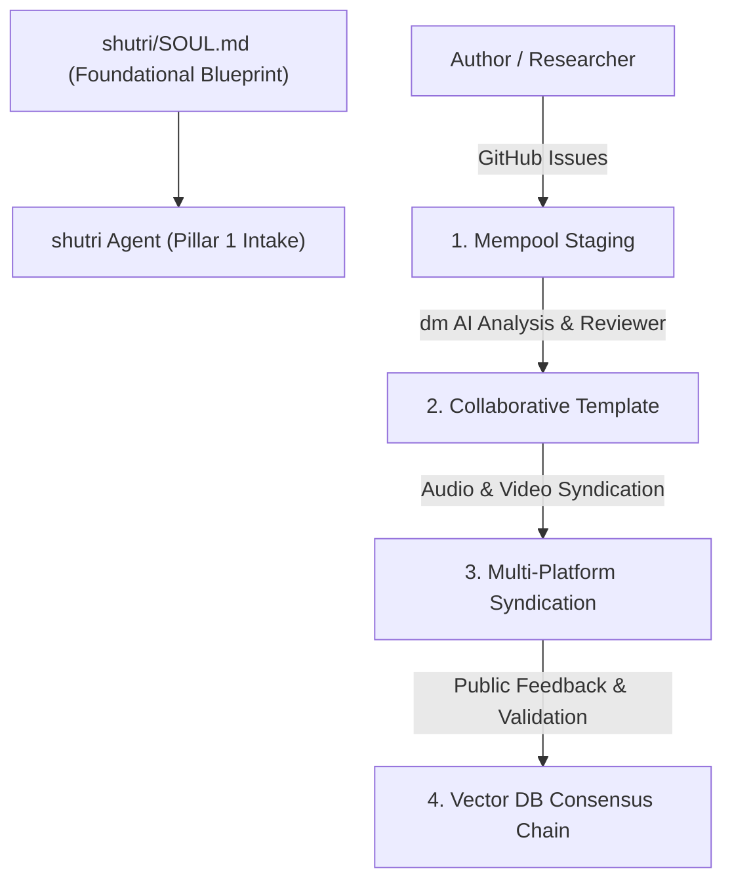

# Shutri Media Solution (SMS): Research Intake Agent (`AGENTS.md`)

> **Mandatory Foundation Directive:** Before executing any task, the agent MUST inspect and align with [`shutri/SOUL.md`](file:///c:/Users/ashut/OneDrive/Desktop/github/shutri/SOUL.md). All agents derive from `SOUL.md` and work in synergy.

---

## 🏛️ Pillar 1: Research Intake Architecture

**Shutri** is the entry portal, staging area, and peer-review substrate for the **Shutri Media Solution (SMS)**. 

Peer review is an open, transparent, collaborative dialogue between human researchers and artificial intelligence (`deepMind`/`dm`), governed by open-source principles (**CC BY-SA 4.0**).

---

## 🤖 Antigravity Agent Directives

### 1. Derivation from `SOUL.md`
- Always verify that intake activities align with the broader SMS ecosystem.
- Recognize that intake drafts will transition to **Pillar 2 (`mdIngest`/`deepDive`)** via the Lossless Python Payload and eventually to **Pillar 3 (`ddma`)**.

### 2. Deterministic Navigation Principle
- **Minimize Token Consumption:** The Antigravity agent MUST NOT waste intelligence tokens on manual string manipulation of issue drafts.
- **CLI & Script Execution:** Use deterministic commands (`git`, `gh`, issue parsers) to inspect and process intake items.
- **Upstream Hardening Loop:** If an intake parser fails during triage, patch the script upstream, recompile, and re-run.

### 3. The 4-Phase Intake Lifecycle
1. **Submitter Draft (Staging):** Submissions enter via GitHub Issues. Verify safety boundaries—ensure no private or copyrighted content is ingested.
2. **Mempool (AI Ingestion & Perspective):** `deepMind` (`dm`) parses the submission and drafts an open synthesis report.
3. **Template (Human-AI Production):** Author and reviewer collaborate to build media assets.
4. **Chain (Vector Database Consensus):** When 21 papers reach final consensus, the block is minted into the permanent `deepMind` Notebook Vector Database ledger.
