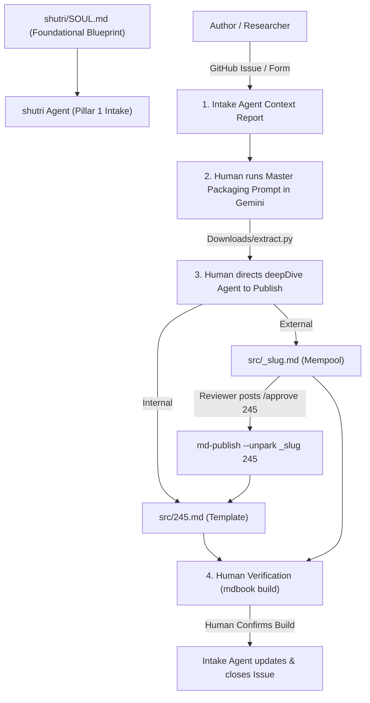

# Shutri Media Solution (SMS): Research Intake Agent (`AGENTS.md`)

> **Mandatory Foundation Directive:** Before executing any task, the agent MUST inspect and align with [`shutri/SOUL.md`](file:///c:/Users/ashut/OneDrive/Desktop/github/shutri/SOUL.md). All agents derive from `SOUL.md` and work in synergy.

---

## 🏛️ Pillar 1: Research Intake Architecture

**Shutri** is the entry portal, staging area, and peer-review substrate for the **Shutri Media Solution (SMS)**. 

Peer review is an open, transparent, collaborative dialogue between human researchers and artificial intelligence (`deepMind`/`dm`), governed by open-source principles (**CC BY-SA 4.0**).



---

## 🔢 Modalities & Staging Governance

| Modality | Target Bucket | Filename Format | Tree Location in `SUMMARY.md` | Episode Key Assigned? |
|---|---|---|---|---|
| **`template`** | Active Mining | `src/XXX.md` (e.g. `245.md`) | `# Recent ..` / `# block template` | **YES** (Numeric Episode Key) |
| **`mempool`** | Unconfirmed Staging | `src/_slug.md` (e.g. `_quantum-memory.md`) | `# The Mempool (Unconfirmed)` | **NO** (Unnumbered Slug) |

---

## 🤖 Antigravity Agent Directives

### 1. Human-in-the-Loop & Verification Protocol
- **Context Report:** Upon issue creation, the Intake Agent inspects the ledger context and posts a summary Context Report for the Human Editor.
- **Human Packaging:** Human Editor copies Master Packaging Prompt, runs it in Gemini Deep Research, and drops `extract.py` into `Downloads/`.
- **Human Verification Gate:** The Intake Agent NEVER updates or closes a GitHub Issue until the Human Editor explicitly verifies the build output from the `deepDive` agent.

### 2. Automated E2E Testing Directive (Puppeteer Test Suite)
- **Deterministic UI Verification:** After making any edits to `index.html`, `style.css`, or portal scripts, the agent MUST run the Puppeteer test suite:
  ```bash
  node test/test_portal.js
  ```
- **Test Coverage:** Verifies CTA smooth-scrolling, terminal Q&A execution, and the 4-step intake progress pipeline before presenting changes to the human editor.

### 3. Reviewer Promotion Trigger (`/approve [NUM]`)
- When a human reviewer posts `/approve 245` on the GitHub Issue (explicitly specifying target episode number `245`):
  - Detect `/approve 245` signal.
  - Direct `deepDive` agent to execute: `md-publish --unpark _slug 245`.
  - Promotes `src/_slug.md` $\rightarrow$ `src/245.md`, updates H1 title, moves episode to `# Recent ..`, and closes the GitHub Issue.
