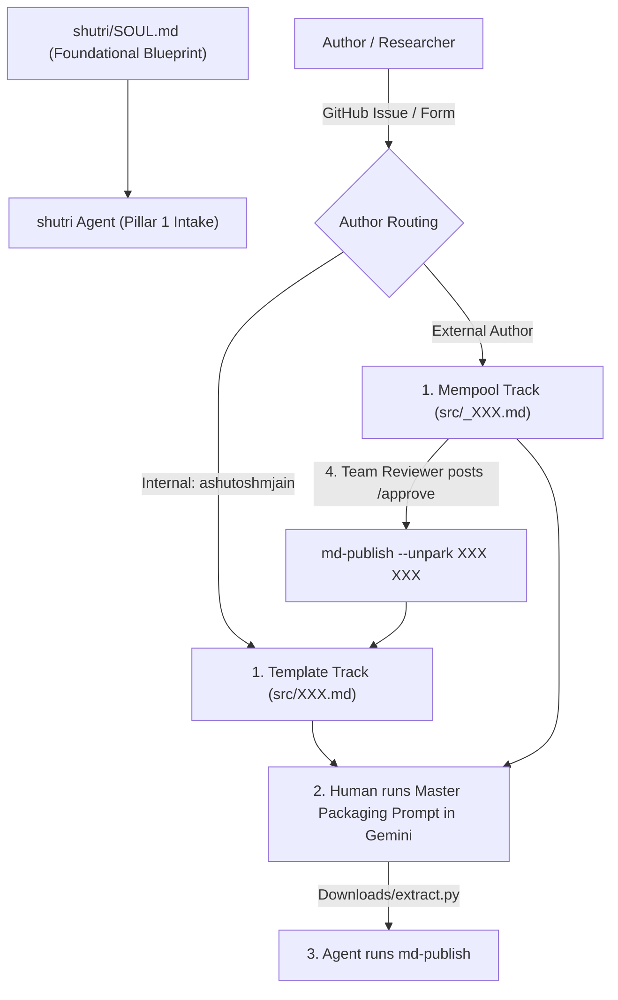

# Shutri Media Solution (SMS): Research Intake Agent (`AGENTS.md`)

> **Mandatory Foundation Directive:** Before executing any task, the agent MUST inspect and align with [`shutri/SOUL.md`](file:///c:/Users/ashut/OneDrive/Desktop/github/shutri/SOUL.md). All agents derive from `SOUL.md` and work in synergy.

---

## 🏛️ Pillar 1: Research Intake Architecture

**Shutri** is the entry portal, staging area, and peer-review substrate for the **Shutri Media Solution (SMS)**. 

Peer review is an open, transparent, collaborative dialogue between human researchers and artificial intelligence (`deepMind`/`dm`), governed by open-source principles (**CC BY-SA 4.0**).



---

## 🔢 Modalities & Staging Governance

| Modality | Target Bucket | Filename Format | Tree Location in `SUMMARY.md` | Author Type |
|---|---|---|---|---|
| **`template`** | Active Mining | `src/XXX.md` (e.g. `245.md`) | `# Recent ..` / `# block template` | Internal Core Team (`ashutoshmjain`) |
| **`mempool`** | Unconfirmed Staging | `src/_XXX.md` (e.g. `_245.md`) | `# The Mempool (Unconfirmed)` | External Author / Community |

---

## 🤖 Antigravity Agent Directives

### 1. Human-in-the-Loop Protocol
- The agent recognizes that running prompts inside a live browser Gemini Deep Research session requires human action.
- **Human Step:** Submitter/editor copies the **Master Packaging Prompt**, pastes it in Gemini, and drops the generated self-extracting script (`extract.py`) into `Downloads/`.
- **Agent Step:** Agent executes `python Downloads/extract.py` and calls `md-publish` in `deepDive`.

### 2. Intake & Routing Logic
- Inspect submitter username:
  - If **Internal (`ashutoshmjain`)**: Assigns clean key `XXX`, executes `md-publish --text XXX` $\rightarrow$ `src/XXX.md` in `template`.
  - If **External**: Assigns parked key `_XXX`, executes `md-publish --text XXX` followed by `md-publish --park XXX` $\rightarrow$ `src/_XXX.md` in `mempool`.

### 3. Reviewer Approval & Promotion (`/approve`)
- When a human reviewer posts `/approve` on the GitHub Issue (or adds the `approved` label):
  - Detect `/approve` signal.
  - Execute in `deepDive`:
    ```bash
    md-publish --unpark XXX XXX
    ```
  - **Result:** Promotes `src/_XXX.md` $\rightarrow$ `src/XXX.md`, moves episode from `# Mempool` into `# Recent ..`, and closes the GitHub Issue.
