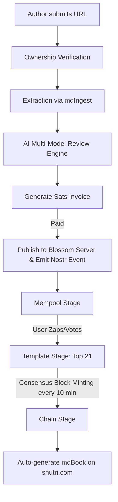

# Shutri: Nostr-Powered Peer-Reviewed Research Platform
## Implementation & Architecture Plan

Shutri acts as a peer-reviewed media workflow engine and journal. Researchers submit web page links, pay a fee in sats to prove ownership and trigger extraction/AI review, and host the content on a Blossom server. Nostr users vote with Zaps to promote articles from the mempool to templates and eventually commit them to a Bitcoin-synced mdBook chain.

---

---

## 1. Core Architecture Components

### A. Ownership Verification & Ingestion
*   **Verification Mechanisms**:
    *   **DNS TXT Record**: The author creates a TXT record `_shutri.<domain>` pointing to their Nostr pubkey.
    *   **Meta Tag**: A `<meta name="shutri-pubkey" content="npub...">` on the target page.
    *   **Fallback File**: Serving a file `/well-known/shutri.txt` containing the pubkey.
*   **Extraction Engine (`mdIngest`)**:
    *   Converts the verified URL into high-quality, sanitized Markdown.
    *   Extracts and standardizes infographics/images, optimizing them for Blossom storage.
    *   Flags mathematical equations to format them for KaTeX rendering.

### B. Blossom Server & Nostr Event Design
*   **Blossom Server**:
    *   A protocol (NIP-like BLOB storage) for hosting media content addressed by SHA-256 hashes.
    *   Shutri runs its own Blossom instance to host the compiled markdown content, high-resolution figures, and verification metadata.
*   **Nostr Event Kind (Custom Parameterized Replaceable Event - e.g., Kind `30210`)**:
    *   **Tags**:
        *   `d`: Unique identifier (e.g., slug of the web page or hash of content).
        *   `u`: Verified original URL.
        *   `blossom`: URL of the hosted blob containing the full markdown text.
        *   `proof`: Cryptographic proof of verification and extraction signed by Shutri.
        *   `author`: Author's Nostr pubkey.
        *   `status`: Current status (`mempool`, `template`, `chain`).
        *   `title`, `summary`, `categories`.
        *   `ai-score`: Average review scores from the verification models.

### C. AI Multi-Agent Review Engine
*   Checks for:
    *   **Mathematical & Logical Accuracy**: Validates mathematical expressions, proofs, and claims.
    *   **Content Categorization**: Categorizes research topic and evaluates significance.
    *   **Plagiarism & Quality Control**: Analyzes structural clarity.
*   **Feedback loop**: AI reviews are published as distinct Nostr annotation events (e.g., NIP-84/89 annotations or a dedicated custom Kind) linked to the primary research event ID, allowing users to inspect the AI's consensus rating before zapping.

### D. Consensus Engine (Mempool → Template → Chain)
*   **Voting Protocol**:
    *   Nostr users vote using standard Lightning Zaps (NIP-57).
    *   **Zap Split (50/50)**:
        *   **50%** goes to the author's Nostr wallet.
        *   **50%** goes to the Shutri hosting/AI-review pool (Blossom server maintenance).
*   **Lifecycle Stages**:
    *   **Mempool**: The initial stage upon publishing. Research notes are readable, zappable, and undergo active review.
    *   **Template**: Every 10 minutes (Bitcoin block time interval), the zaps are computed. The top 21 research notes (by sat volume) are selected for the current block template.
    *   **Chain**: A block is minted every 10 minutes. The selected notes are committed into the block, freezing their content.
    *   **mdBook Sync**: The frozen block triggers an automatic update to the mdBook platform hosted at `shutri.com`, matching the aesthetic style of `deepDive.shutri.com`.

---

## 2. Relay Requirement Analysis

### Question: Does Shutri need to run an event-specific relay?
**Yes, Shutri absolutely needs to run a specialized custom relay.**

Here is the strategic and technical justification:

1.  **Enforcing Economic Paywalls**:
    General-purpose relays cannot enforce transaction state. Shutri charges sat fees for ingestion, verification, and AI review. A dedicated relay can validate that a Kind `30210` event is only accepted and broadcast *if and only if* the associated payment invoice has been successfully settled.
2.  **State Promotion Engine**:
    The transition of research notes between `mempool` $\rightarrow$ `template` $\rightarrow$ `chain` relies on state tracking (such as zap aggregations and time intervals). A dedicated relay can dynamically modify or inject state tags on replaceable events, serving client queries with instant metadata (e.g., current vote count, block number).
3.  **Guaranteed Event Persistence**:
    Nostr clients need guaranteed availability of research papers and graphics. General relays frequently prune custom, high-byte-count events or files. Shutri's relay guarantees 100% availability, matching the availability of the Blossom blobs.
4.  **Optimized Gossip Routing**:
    Clients rendering the Shutri journal will query a reliable outbox source of truth. Connecting directly to `relay.shutri.com` ensures they fetch accurate consensus structures, block configurations, and mathematical annotations without crawling dozens of public relays.

---

## 3. Phased Implementation Roadmap

### Phase 1: Ingestion & Verification MVP
*   Build the ownership verification loop (DNS and meta tag verification).
*   Implement `mdIngest` content extractor to parse clean Markdown and KaTeX math blocks.
*   Set up the Blossom server to host extracted text, images, and HTML artifacts.
*   Deploy a prototype relay that supports writing and reading the custom Kind `30210` web event.

### Phase 2: AI Review & Lightning Integration
*   Deploy the multi-agent AI verification workers (LLM-based logic and math check).
*   Implement LNURL/LND invoice generation for extraction fees.
*   Configure Zap splits (50% Author / 50% Shutri platform) using NIP-57 tags on the research event.

### Phase 3: Consensus & Bitcoin-Synced Minting
*   Implement the 10-minute Bitcoin-interval block generator.
*   Create the voting tracker that aggregates zaps and sorts the top 21 candidates.
*   Develop the automated mdBook generation pipeline to build and publish the latest blocks on `shutri.com`.
