# Shutri: The Architecture of Collaborative Intelligence

```mermaid
graph TD
    Sub[1. Submitter Draft] -->|Submit Portal / GitHub Issues| Mem[2. Mempool: AI Ingestion]
    Mem -->|dm Parser & Filter| Ingest[mdIngest Extraction]
    Ingest -->|Gemini Perspective & Reviewer Assignment| Temp[3. Template: Collaborative Production]
    Temp -->|Author + Reviewer Assets| Media[Spotify, YouTube Music, Apple, Fountain.fm, TikTok, IG]
    Media -->|Public Feedback & Validation| Chain[4. Chain: Vector Ingestion]
    Chain -->|21 Verified Blocks Ingested| DB[deepMind Notebook Vector DB]
    style Sub fill:#0f172a,stroke:#3b82f6,stroke-width:2px;
    style Mem fill:#0f172a,stroke:#f59e0b,stroke-width:2px;
    style Temp fill:#0f172a,stroke:#10b981,stroke-width:2px;
    style Chain fill:#0f172a,stroke:#6366f1,stroke-width:4px;
```

---

## I. The Core Philosophy of Shutri
Historically, peer review has been an insular, anonymous black box:
* Reviewers are hidden from public view.
* Review reports and critiques are permanently locked away.
* Readers only see the final, static paper.

**Shutri** transitions peer review into the open. It operates not as a business or commercial publisher, but as a **reputed, open-source collaborative journal**. By leveraging the combination of advanced artificial intelligence (**dm**) and human peer review, Shutri transforms the review process into a public dialogue. The goal is to maximize collaborative learning, expand technical literacy, and spread awareness of high-density scientific and philosophical research.

---

## II. The Ingest Pipeline & Lifecycle of Knowledge

The journey of research through Shutri is structured like a decentralized transaction pipeline:

### 1. Submitter Draft (Staging)
* **Action:** The author submits their public research URL (along with abstracts/repos) via the open portal.
* **Criterion:** Ingestion is free, but acceptance is strictly subject to an initial AI evaluation as well as a human reviewer signing off.

### 3. Mempool (AI Ingestion & Perspective)
* **Action:** Once accepted, the research is queued in the **Mempool**.
* **AI Gatekeeper:** The model **dm (deepMind)** acts as the first filter. It parses the submission for core logical structures, evaluates it against its extensive background knowledge base, and drafts a transparent synthesis report.
* **Extraction:** The human reviewer utilizes the [mdIngest](https://github.com/ashutoshmjain/mdIngest) toolchain to extract the perspective and host it on the deepDive archive under the Mempool staging directory.

### 4. Template (Human-AI Collaborative Artifacts)
* **Action:** A human reviewer is assigned to the paper to evaluate dm's synthesis report. The author and reviewer then collaboratively build media assets to communicate the research to the public.
* **Media Assets:**
  * **Long-form audio (30–50 mins):** Distributed on Spotify, Apple Podcasts, YouTube Music, and Fountain.fm.
  * **Infographic videos (18–20 mins):** Shared on Instagram, TikTok, and YouTube.
  * **Infographic clips (2–3 mins):** Highlights shared on Instagram, TikTok, and YouTube.
* **Why Social Media?** Shutri believes that collaborative intelligence requires leveraging public participation. Broadcasting to social networks meets real people where they are, inviting open discussion and collective feedback.

### 5. Chain (Vector Database Consensus)
* **Action:** Once the public review window closes and a block size of **21 finalized articles** is reached, the block is "minted" onto the deepDive blockchain.
* **The Knowledge Blockchain:** Unlike financial ledgers (e.g., Ethereum), the blockchain of knowledge is about **layering structured, filtered insights into the LLM**. Each new block of 21 finalized papers is appended directly into the deepMind Notebook, layering the active AI knowledge base.
* **Current State:** Following the initial Genesis Block, Shutri has already successfully ingested its first block of public-reviewed research.

---

## III. Licensing, Infrastructure, and Constraints

* **Open Substrate:** All review notes, audio, and visual assets are published under a **Creative Commons Attribution-ShareAlike 4.0 International license** to ensure the synthesized knowledge remains public domain forever.
* **Safety Boundaries:** To protect intellectual property rights, contributors are strictly warned **never to submit private, confidential, or copyrighted research**.
* **Why GitHub?** Instead of using Discord (limited community reach) or Nostr (decentralized but fragmented), Shutri chose GitHub Issue management. It represents the most transparent, AI-friendly, and ubiquitous platform available, ensuring a frictionless process for researchers and reviewers alike.
