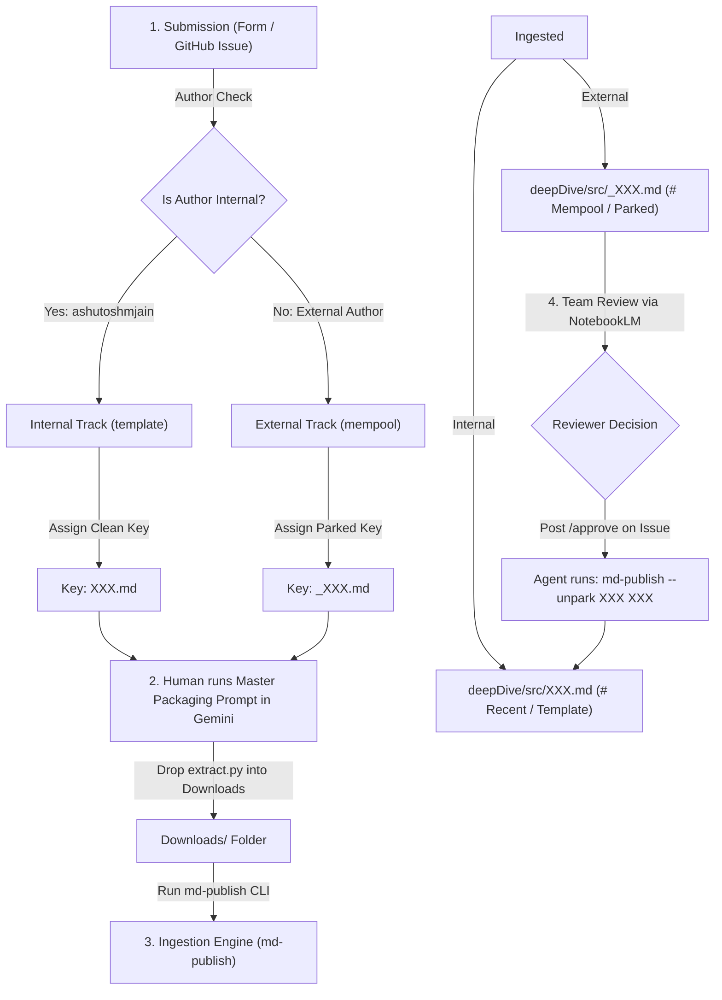

# Research Ingestion & Peer Review Workflow

> **End-to-End Guide for Internal & External Research Intake in the Shutri Media Solution (SMS)**

---

## 🏛️ Workflow Overview

The research ingestion pipeline bridges human researchers, **deepMind AI (`dm`)**, and the **deepDive** knowledge ledger through a clear 4-step lifecycle:



---

## 🔢 1. Numbering & Staging Modalities

| Modality | Staging Target | Filename Format | Tree Location in `SUMMARY.md` | Author Type |
|---|---|---|---|---|
| **`template`** | Active Mining / Production | `src/XXX.md` (e.g. `245.md`) | `# Recent ..` / `# block template` | Internal Core Team (`ashutoshmjain`) |
| **`mempool`** | Unconfirmed Staging | `src/_XXX.md` (e.g. `_245.md`) | `# The Mempool (Unconfirmed)` | External Author / Community |

---

## 📋 2. Step-by-Step Lifecycle Guide

### Step 1: Research Submission
- Submitter uses the form on **`shutri.com`** or opens a GitHub Issue.
- The **Intake Agent** inspects the submitter username:
  - If **Internal (`ashutoshmjain`)**: Assigns Episode Key `XXX` and routes to **`template`**.
  - If **External**: Assigns Parked Key `_XXX` and routes to **`mempool`**.

### Step 2: Human-in-the-Loop Packaging (Gemini Deep Research)
- The submitter/editor copies the **Master Packaging Prompt** from `shutri/SOUL.md` or `mdIngest`.
- Paste the prompt into Gemini Deep Research.
- Save the resulting self-extracting Python script (`extract.py`) into your local `Downloads/` folder.

### Step 3: Agent Ingestion (`md-publish`)
- The agent (or editor) executes `python Downloads/extract.py` to yield `final_research.md`.
- **For Internal Track (`template`):**
  ```bash
  md-publish --text XXX
  ```
  *(Creates `src/XXX.md` and indexes under `# Recent ..`)*

- **For External Track (`mempool`):**
  ```bash
  md-publish --text XXX
  md-publish --park XXX
  ```
  *(Creates `src/_XXX.md` and indexes under `# The Mempool`)*

### Step 4: Review & Promotion (`/approve`)
- A team member evaluates `src/_XXX.md` against NotebookLM scope and criteria.
- **To Approve & Promote:**
  - Post `/approve` as a comment on the GitHub Issue (or add the `approved` label).
  - The Intake Agent detects `/approve` and executes:
    ```bash
    md-publish --unpark XXX XXX
    ```
  - **Result:** Promotes `src/_XXX.md` $\rightarrow$ `src/XXX.md`, moves it from `# Mempool` into `# Recent ..`, and closes the GitHub Issue.
