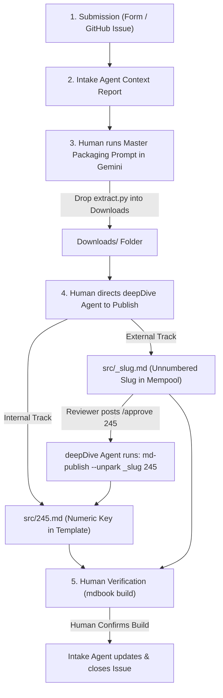

# Research Ingestion & Peer Review Workflow

> **End-to-End Operational Blueprint for Internal & External Research Intake in the Shutri Media Solution (SMS)**

---

## 🏛️ Workflow Overview

The research ingestion pipeline bridges human researchers, **deepMind AI (`dm`)**, and the **deepDive** knowledge ledger through a clear 5-step human-agent handshake:



---

## 🔢 1. Numbering & Staging Modalities

| Modality | Staging Target | Filename Format | Tree Location in `SUMMARY.md` | Episode Key Assigned? |
|---|---|---|---|---|
| **`template`** | Active Mining / Production | `src/XXX.md` (e.g. `245.md`) | `# Recent ..` / `# block template` | **YES** (Numeric Episode Key) |
| **`mempool`** | Unconfirmed Staging | `src/_slug.md` (e.g. `_quantum-memory.md`) | `# The Mempool (Unconfirmed)` | **NO** (Unnumbered Slug) |

> ⚠️ **Critical Rule:** Mempool files MUST use unnumbered slugs (`_slug.md`) to prevent index collisions. Numeric keys (e.g. `245`) are assigned ONLY when an episode enters the Template phase.

---

## 📋 2. Step-by-Step Execution Protocol

### Step 1: Research Submission
- Submitter fills out the form on **`shutri.com`** or submits a GitHub Issue.

### Step 2: Intake Agent Context Report (`shutri`)
- The **Intake Agent** detects the issue, inspects existing issue logs and the active episode ledger, and posts a **Context Report** on the GitHub Issue for the Human Editor:
  - Summarizes submission thesis & source URL.
  - Recommends target track: **Internal Track (Template)** vs **External Track (Mempool)**.

### Step 3: Human-in-the-Loop Packaging (Gemini Deep Research)
- The Human Editor copies the **Master Packaging Prompt** from `shutri/SOUL.md`.
- Paste the prompt into the Gemini Deep Research session.
- Drop the generated self-extracting Python script (`extract.py`) into local `Downloads/`.

### Step 4: Content Orchestrator Ingestion (`deepDive`)
- The Human Editor directs the **`deepDive` Content Orchestrator Agent** to publish the research.
- **For Internal Track (`template`):**
  - `deepDive` agent assigns the target Episode Number (e.g., `245`).
  - Executes: `python Downloads/extract.py` $\rightarrow$ `md-publish --text 245` $\rightarrow$ creates `src/245.md`.
- **For External Track (`mempool`):**
  - `deepDive` agent uses the unnumbered slug (e.g. `_quantum-memory`).
  - Executes: `python Downloads/extract.py` $\rightarrow$ `md-publish --text quantum-memory` $\rightarrow$ `md-publish --park quantum-memory` $\rightarrow$ creates `src/_quantum-memory.md`.
- Agent executes `mdbook build` and presents the build log to the Human Editor.

### Step 5: Human Verification & Issue Update
- The Human Editor inspects the build output to verify rendering.
- Upon human confirmation, the **Intake Agent** updates and closes the GitHub Issue.

---

## 🚀 3. Mempool Promotion Protocol (`/approve [NUM]`)

When an unnumbered Mempool draft (e.g. `src/_quantum-memory.md`) is approved for production:
1. Human reviewer posts **`/approve 245`** as a comment on the GitHub Issue, explicitly specifying target Episode Number `245`.
2. The `deepDive` agent detects the `/approve 245` command and executes:
   ```bash
   md-publish --unpark _quantum-memory 245
   ```
3. **Result:** Promotes `src/_quantum-memory.md` $\rightarrow$ `src/245.md`, updates the H1 title to `# 245 : Title`, moves the episode from `# Mempool` into `# Recent ..`, and closes the GitHub Issue.
