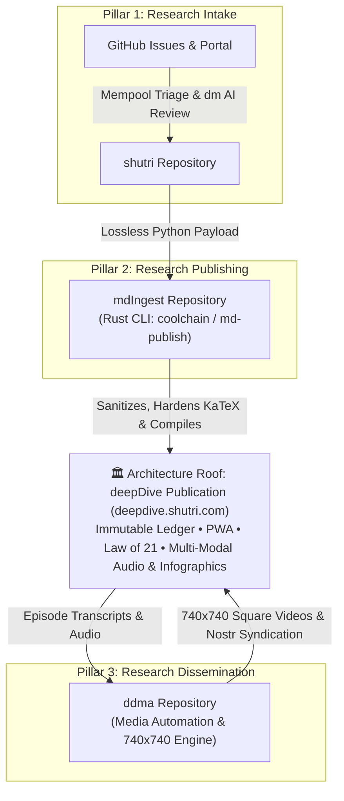

# Shutri Media Solution (SMS): Master Architecture & Governance

> **System Blueprint & Agent Navigation Model**

---

## 🏛️ 1. High-Level Solution Architecture

The **Shutri Media Solution (SMS)** is an end-to-end, comprehensive research, publishing, and promotion platform structured into **Three Operational Pillars**:



## 📐 2. The Three Operational Pillars & "Open Restaurant vs. Kitchen" Model

The architecture decouples **The Roof (Reference Publication)** from **The Three Foundational Open-Source Engine Pillars**:

* **🏛️ The Architecture Roof — Reference Publication & Master Ledger ([`deepDive`](https://github.com/ashutoshmjain/deepDive) | [deepdive.shutri.com](https://deepdive.shutri.com)):**
  * The living production ledger containing the 200+ `mdBook` episode ledger (`src/`, `SUMMARY.md`, PWA), KaTeX mathematical rigor, and the integrated Editor Preview infographics player.
  * **Repository:** [`ashutoshmjain/deepDive`](https://github.com/ashutoshmjain/deepDive) • **Live Site:** [deepdive.shutri.com](https://deepdive.shutri.com)

* **Pillar 1: Research Intake ([`shutri`](https://github.com/ashutoshmjain/shutri) | [README](https://github.com/ashutoshmjain/shutri/blob/main/README.md))**
  * **Role:** Intake staging, peer review, and community consensus.
  * **Substrate:** Uses **GitHub Issue Management** as an open, transparent substrate where submitters lodge research drafts, AI (`deepMind`/`dm`) generates synthesis reports, human reviewers collaborate, and verified papers enter the **Mempool**.
  * **Repository:** [`ashutoshmjain/shutri`](https://github.com/ashutoshmjain/shutri)

* **Pillar 2: Research Publishing ([`mdIngest`](https://github.com/ashutoshmjain/mdIngest) | [README](https://github.com/ashutoshmjain/mdIngest/blob/master/README.md))**
  * **Role:** A lean, platform-agnostic Rust CLI (`coolchain` / `md-publish`) and Python extractor (`extract.py`). Holds zero episode content; holds deterministic sanitization, KaTeX hardening, and mdBook preprocessor logic.
  * **Repository:** [`ashutoshmjain/mdIngest`](https://github.com/ashutoshmjain/mdIngest)

* **Pillar 3: Research Dissemination ([`ddma`](https://github.com/ashutoshmjain/ddma) | [README](https://github.com/ashutoshmjain/ddma/blob/main/README.md))**
  * **Role:** DeepDive Media Automator (`ddma.py`, Whisper, FFmpeg, Curator UI). Drives 740x740 square video rendering, Nostr protocol compliance (&lt; 20MB), audio crossfades, and dynamic motion graphics.
  * **Repository:** [`ashutoshmjain/ddma`](https://github.com/ashutoshmjain/ddma)


---

## 🤖 3. The Deterministic Agent Operating Philosophy

```
  ┌─────────────────────────────────────────────────────────────┐
  │                 GOOGLE ANTIGRAVITY (AGY)                    │
  │            Intelligent Agent (The Navigator)               │
  └──────────────────────────────┬──────────────────────────────┘
                                 │ Invokes Deterministic CLI Commands
                                 ▼
  ┌─────────────────────────────────────────────────────────────┐
  │                   DETERMINISTIC CODEBASE                    │
  │                  "The House We Are Building"                │
  │                                                             │
  │  • md-publish (Rust CLI)     • ddma.py (Fast Demuxer & Fades)│
  │  • mdbook / mdbook-katex     • FFmpeg & Whisper Pipelines     │
  └──────────────────────────────┬──────────────────────────────┘
                                 │ When Bugs / Edge Cases Are Found
                                 ▼
  ┌─────────────────────────────────────────────────────────────┐
  │                   UPSTREAM HARDENING LOOP                   │
  │  Agent patches deterministic code ➔ Recompiles ➔ Re-runs CLI│
  └─────────────────────────────────────────────────────────────┘
```

1. **Deterministic Execution Over Token Waste:** AI LLMs must NOT perform manual text manipulation or video stream slicing in memory. They invoke deterministic CLI tools (`md-publish`, `ddma.py`, `cargo build`, `mdbook build`).
2. **Upstream Hardening Loop:** When an agent encounters a bug in production (`deepDive`), it **never applies a manual band-aid**. It patches the underlying deterministic codebase (`mdIngest/crate/src/sanitizer.rs` or `ddma/ddma.py`), compiles the update, and re-executes.
3. **Compounding System Strength:** Every episode publication makes the underlying codebase more resilient for future runs.

---

## 📂 4. Repository Agent Mapping Matrix

| Pillar | Repository | README | Agent Role | Config File | Deterministic Codebase |
|---|---|---|---|---|---|
| **1. Intake** | [`ashutoshmjain/shutri`](https://github.com/ashutoshmjain/shutri) | [README.md](https://github.com/ashutoshmjain/shutri/blob/main/README.md) | Research Intake Agent | [`shutri/AGENTS.md`](file:///c:/Users/ashut/OneDrive/Desktop/github/shutri/AGENTS.md) | GitHub Issue Parsers, Staging Scripts |
| **2. Engine** | [`ashutoshmjain/mdIngest`](https://github.com/ashutoshmjain/mdIngest) | [README.md](https://github.com/ashutoshmjain/mdIngest/blob/master/README.md) | Ingestion Engine Agent | [`mdIngest/AGENTS.md`](file:///c:/Users/ashut/OneDrive/Desktop/github/mdIngest/AGENTS.md) | Rust `md-publish` binary (`crate/src/`) |
| **2. App** | [`ashutoshmjain/deepDive`](https://github.com/ashutoshmjain/deepDive) | [README.md](https://github.com/ashutoshmjain/deepDive/blob/master/README.md) | Content Orchestrator Agent | [`deepDive/AGENTS.md`](file:///c:/Users/ashut/OneDrive/Desktop/github/deepDive/AGENTS.md) | `mdBook`, `mdbook-katex`, `SUMMARY.md` Indexer |
| **3. Promotion** | [`ashutoshmjain/ddma`](https://github.com/ashutoshmjain/ddma) | [README.md](https://github.com/ashutoshmjain/ddma/blob/main/README.md) | Media Automator Agent | [`ddma/.agents/AGENTS.md`](file:///c:/Users/ashut/OneDrive/Desktop/github/ddma/.agents/AGENTS.md) | `ddma.py`, FFmpeg fast demuxer, Whisper crossfader |c Codebase |
|---|---|---|---|---|
| **1. Intake** | **`shutri`** | Research Intake Agent | [`shutri/AGENTS.md`](file:///c:/Users/ashut/OneDrive/Desktop/github/shutri/AGENTS.md) | GitHub Issue Parsers, Staging Scripts |
| **2. Engine** | **`mdIngest`** | Ingestion Engine Agent | [`mdIngest/AGENTS.md`](file:///c:/Users/ashut/OneDrive/Desktop/github/mdIngest/AGENTS.md) | Rust `md-publish` binary (`crate/src/`) |
| **2. App** | **`deepDive`** | Content Orchestrator Agent | [`deepDive/AGENTS.md`](file:///c:/Users/ashut/OneDrive/Desktop/github/deepDive/AGENTS.md) | `mdBook`, `mdbook-katex`, `SUMMARY.md` Indexer |
| **3. Promotion** | **`ddma`** | Media Automator Agent | [`ddma/.agents/AGENTS.md`](file:///c:/Users/ashut/OneDrive/Desktop/github/ddma/.agents/AGENTS.md) | `ddma.py`, FFmpeg fast demuxer, Whisper crossfader |
