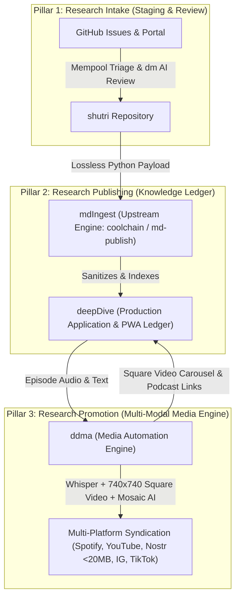

# Shutri Media Solution (SMS): Master Architecture & Governance

> **System Blueprint & Agent Navigation Model**

---

## 🏛️ 1. High-Level Solution Architecture

The **Shutri Media Solution (SMS)** is an end-to-end, comprehensive research, publishing, and promotion platform structured into **Three Operational Pillars**:



## 📐 2. The Three Operational Pillars & "Open Restaurant vs. Kitchen" Model

The architecture decouples **Public Open-Source Engine Codebases** ("The Open Restaurants") from the **Master Production Ledger & Asset Kitchen** ("The Kitchen"):

* **Public Open-Source Engine Codebases:**
  * **[`mdIngest`](https://github.com/ashutoshmjain/mdIngest):** Upstream Rust publishing CLI (`md-publish`). Holds **zero episode content or media assets**.
  * **[`ddma`](https://github.com/ashutoshmjain/ddma):** Upstream Python media automator codebase (`ddma.py`, `curator.html`). Holds the open-source media rendering engine tool.
  * **[`shutri`](https://github.com/ashutoshmjain/shutri):** Public intake portal and peer review registry substrate.

* **Master Production Ledger & Asset Kitchen ([`deepDive`](https://github.com/ashutoshmjain/deepDive)):**
  * Serves as the single repository containing **both** the 200+ `mdBook` episode ledger (`src/`, `SUMMARY.md`, PWA) and the integrated **`deepDive/ddma/`** app instance holding all generated podcast audio, Nostr 740x740 square video clips, and infographic assets.

---

### Pillar 1: Research Intake ([`shutri`](https://github.com/ashutoshmjain/shutri) | [README](https://github.com/ashutoshmjain/shutri/blob/main/README.md))
* **Role:** Intake staging, peer review, and community consensus.
* **Substrate:** Uses **GitHub Issue Management** as an open, transparent substrate where submitters lodge research drafts, AI (`deepMind`/`dm`) generates synthesis reports, human reviewers collaborate, and verified papers enter the **Mempool**.
* **Repository:** [`ashutoshmjain/shutri`](https://github.com/ashutoshmjain/shutri) • **Documentation:** [`shutri/README.md`](https://github.com/ashutoshmjain/shutri/blob/main/README.md)

### Pillar 2: Research Publishing Engine & Master Ledger
* **Upstream Open Engine ([`mdIngest`](https://github.com/ashutoshmjain/mdIngest) | [README](https://github.com/ashutoshmjain/mdIngest/blob/master/README.md)):** A lean, platform-agnostic Rust CLI (`coolchain` / `md-publish`). Holds zero episode content; holds only deterministic sanitization, KaTeX hardening, and indexer logic.
  * **Repository:** [`ashutoshmjain/mdIngest`](https://github.com/ashutoshmjain/mdIngest) • **Documentation:** [`mdIngest/README.md`](https://github.com/ashutoshmjain/mdIngest/blob/master/README.md)
* **Master Ledger & PWA ([`deepDive`](https://github.com/ashutoshmjain/deepDive) | [README](https://github.com/ashutoshmjain/deepDive/blob/master/README.md)):** The live, consumer-facing Progressive Web App ([deepdive.shutri.com](https://deepdive.shutri.com)) holding the 200+ episode ledger, PWA service workers, `SUMMARY.md` tree, and integrated media kitchen (`deepDive/ddma/`).
  * **Repository:** [`ashutoshmjain/deepDive`](https://github.com/ashutoshmjain/deepDive) • **Documentation:** [`deepDive/README.md`](https://github.com/ashutoshmjain/deepDive/blob/master/README.md)

### Pillar 3: Research Promotion & Integrated Media Kitchen ([`ddma`](https://github.com/ashutoshmjain/ddma) | [README](https://github.com/ashutoshmjain/ddma/blob/main/README.md))
* **Public Engine Repo:** [`ashutoshmjain/ddma`](https://github.com/ashutoshmjain/ddma) — Open-source Python automation tool (`ddma.py`, Whisper, FFmpeg, Curator UI).
* **Production Kitchen Instance:** Integrated inside [`deepDive/ddma/`](file:///c:/Users/ashut/OneDrive/Desktop/github/deepDive/ddma/) holding the live app and all episode media assets (podcasts, Nostr 740x740 square videos, title cards).


---

## 🤖 3. The Deterministic Agent Operating Philosophy

```
  ┌─────────────────────────────────────────────────────────────┐
  │                 GOOGLE ANTIGRAVITY (AGY)                    │
  │            Intelligent Agent (The Navigator)               │
  └──────────────────────────────┬──────────────────────────────┘
                                 │ Invokes Deterministic CLI Commands
                                 ▼
  ┌─────────────────────────────────────────────────────────────┐
  │                   DETERMINISTIC CODEBASE                    │
  │                  "The House We Are Building"                │
  │                                                             │
  │  • md-publish (Rust CLI)     • ddma.py (Fast Demuxer & Fades)│
  │  • mdbook / mdbook-katex     • FFmpeg & Whisper Pipelines     │
  └──────────────────────────────┬──────────────────────────────┘
                                 │ When Bugs / Edge Cases Are Found
                                 ▼
  ┌─────────────────────────────────────────────────────────────┐
  │                   UPSTREAM HARDENING LOOP                   │
  │  Agent patches deterministic code ➔ Recompiles ➔ Re-runs CLI│
  └─────────────────────────────────────────────────────────────┘
```

1. **Deterministic Execution Over Token Waste:** AI LLMs must NOT perform manual text manipulation or video stream slicing in memory. They invoke deterministic CLI tools (`md-publish`, `ddma.py`, `cargo build`, `mdbook build`).
2. **Upstream Hardening Loop:** When an agent encounters a bug in production (`deepDive`), it **never applies a manual band-aid**. It patches the underlying deterministic codebase (`mdIngest/crate/src/sanitizer.rs` or `ddma/ddma.py`), compiles the update, and re-executes.
3. **Compounding System Strength:** Every episode publication makes the underlying codebase more resilient for future runs.

---

## 📂 4. Repository Agent Mapping Matrix

| Pillar | Repository | README | Agent Role | Config File | Deterministic Codebase |
|---|---|---|---|---|---|
| **1. Intake** | [`ashutoshmjain/shutri`](https://github.com/ashutoshmjain/shutri) | [README.md](https://github.com/ashutoshmjain/shutri/blob/main/README.md) | Research Intake Agent | [`shutri/AGENTS.md`](file:///c:/Users/ashut/OneDrive/Desktop/github/shutri/AGENTS.md) | GitHub Issue Parsers, Staging Scripts |
| **2. Engine** | [`ashutoshmjain/mdIngest`](https://github.com/ashutoshmjain/mdIngest) | [README.md](https://github.com/ashutoshmjain/mdIngest/blob/master/README.md) | Ingestion Engine Agent | [`mdIngest/AGENTS.md`](file:///c:/Users/ashut/OneDrive/Desktop/github/mdIngest/AGENTS.md) | Rust `md-publish` binary (`crate/src/`) |
| **2. App** | [`ashutoshmjain/deepDive`](https://github.com/ashutoshmjain/deepDive) | [README.md](https://github.com/ashutoshmjain/deepDive/blob/master/README.md) | Content Orchestrator Agent | [`deepDive/AGENTS.md`](file:///c:/Users/ashut/OneDrive/Desktop/github/deepDive/AGENTS.md) | `mdBook`, `mdbook-katex`, `SUMMARY.md` Indexer |
| **3. Promotion** | [`ashutoshmjain/ddma`](https://github.com/ashutoshmjain/ddma) | [README.md](https://github.com/ashutoshmjain/ddma/blob/main/README.md) | Media Automator Agent | [`ddma/.agents/AGENTS.md`](file:///c:/Users/ashut/OneDrive/Desktop/github/ddma/.agents/AGENTS.md) | `ddma.py`, FFmpeg fast demuxer, Whisper crossfader |c Codebase |
|---|---|---|---|---|
| **1. Intake** | **`shutri`** | Research Intake Agent | [`shutri/AGENTS.md`](file:///c:/Users/ashut/OneDrive/Desktop/github/shutri/AGENTS.md) | GitHub Issue Parsers, Staging Scripts |
| **2. Engine** | **`mdIngest`** | Ingestion Engine Agent | [`mdIngest/AGENTS.md`](file:///c:/Users/ashut/OneDrive/Desktop/github/mdIngest/AGENTS.md) | Rust `md-publish` binary (`crate/src/`) |
| **2. App** | **`deepDive`** | Content Orchestrator Agent | [`deepDive/AGENTS.md`](file:///c:/Users/ashut/OneDrive/Desktop/github/deepDive/AGENTS.md) | `mdBook`, `mdbook-katex`, `SUMMARY.md` Indexer |
| **3. Promotion** | **`ddma`** | Media Automator Agent | [`ddma/.agents/AGENTS.md`](file:///c:/Users/ashut/OneDrive/Desktop/github/ddma/.agents/AGENTS.md) | `ddma.py`, FFmpeg fast demuxer, Whisper crossfader |
