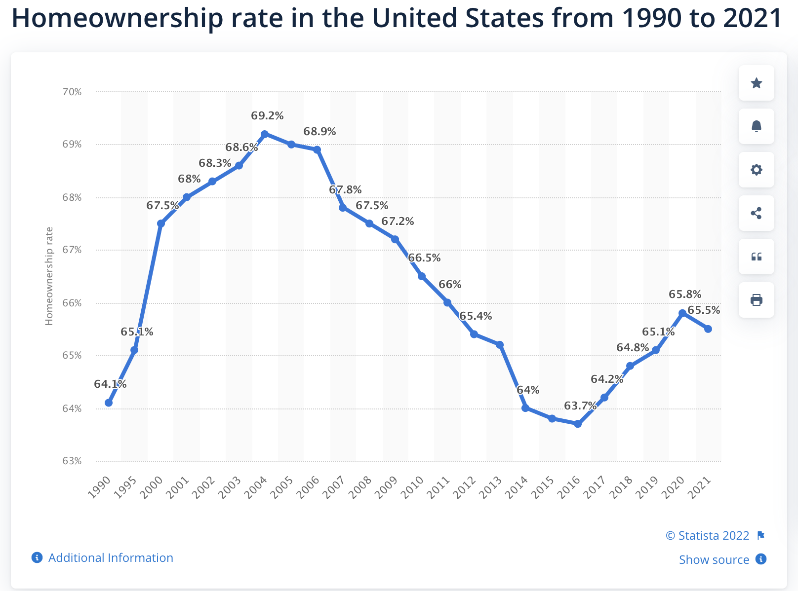

- As opposite to the [[subPrime]] mortgage crisis a [[superPrime]] mortgage crisis is in the making, thanks to [[fedBlunder]] of 2022 #spotlight
  
  We are recovering from an home ownership crisis and with [[fedBlunder]] on interest rates , this is again going to decline.  And the biggest risk is urban markets  because of [[WFH]]
	- Urban markets already have inflated home prices.  One of the driver of higher prices in urban areas is commute from work place.  If I am allowed to work from anywhere, there is no reason for me to stick to South Bay.. This in itself was an existential crisis for the commercial and residential real estate in the cities , but the new issue is [[risingInterestRate]]
	- Because the prices in the cities were already high,  people are getting priced out even at 3% interest rate. And now we are talking anywhere between 6  to 8 % depending on the nature of mortgage or your credit worthiness. And at the same time you are looking for a bigger home in suburbs cuz you can work from anywhere.
	- This means a reverse influx from large cities  or corporate centers to the suburban and satellite cities.
	- If 10 % homeowners put their home on sale in a community , the price drops by 30 %
- America is about to see almost fifty % price drop in major cities -  setting up a major real estate bust. It is going to be lot bigger than the housing crisis much bigger than the sub-prime crisis of 2009.
- Which means the biggest ever wealth destruction in the history . The construction activity may sustain as their will be more in the sub-urban areas but those owning large real estates in cities with high mortgages are going to be under water for a long time to come.
- 
-