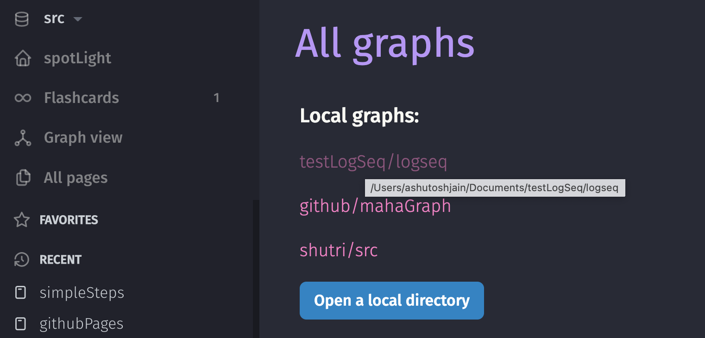
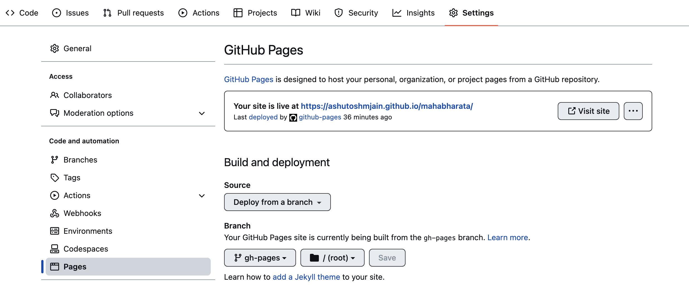

- If you want to publish logseq to the web (like this website), the easiest and zero cost way is to publish it to git hub pages. If you don't know what github pages are , feel free to check out [[githubPages]]
- Here are simple steps to publish logseq to gh pages
	- Go to your logseq folder.  To find your logseq folder, the easiest way is to click the down triangle by the side of the name of your graph and then select "All graph". If you hover your mouse on the name of graphs, it will show the long path to the graph folder.
		- 
	- `git init`  - Initiate git version control.
	- Now I use `gh` a command line  (but very intuitive) interface for github.  Its easy to install from  https://cli.github.com/
	- `gh repo create` - run through the command line options. 
	  #+BEGIN_CAUTION
	  You may need to set up auth token before you could use gh-cli with your github account.
	  #+END_CAUTION
	- Create a branch gh-pages in the github repo.
		- #+BEGIN_QUOTE
		  git checkout --orphan gh-pages
		  git reset --hard
		  git commit --allow-empty -m "Initializing gh-pages branch"
		  git push origin gh-pages
		  git checkout master
		  #+END_QUOTE
	- Login to your account on github (web portal) and reconfirm gh-pages is set up for publishing.
		- You may wanna check your `gh-pages` branch (created above) exists.
		- Click on settings , and from the left pan - select "pages" , and confirm that gh-pages is live - as shown below
			- 
	- Now , on your local machine, cd into the cloned repo and use following commands.
		- #+BEGIN_QUOTE
		  git worktree add /tmp/graph   gh-pages
		  Export your logseq graph to some place on your machine - say ~/Documents/myGraph/
		  rm -rf /tmp/graph/* # this won't delete the .git directory
		  cp -rp ~/Documents/myGraph/*  /tmp/graph/
		  cd /tmp/graph
		  git add -A
		  git commit -m 'say deploy new graph'
		  git push --set-upstream origin gh-pages
		  #+END_QUOTE
		- If you want to publish frequently,  you may use some other folder than /tmp to avoid first step.
	- Give it couple of minutes , and then check your gh-pages url generally  --> <username>.github.io/<reponame>)
	- #+BEGIN_CAUTION
	  You will need to further configure github pages if you wanna direct above url to a custom domain name. 
	  #+END_CAUTION